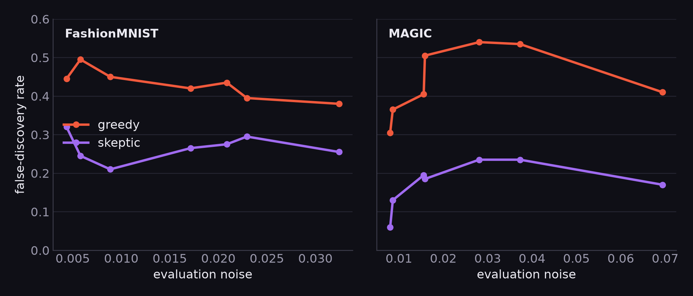

# SAGE — Skeptical Autonomous aGent for Experimentation

> *A good scientist tries to disprove their own results. So does SAGE.*

SAGE is an autonomous **code-editing ML-research agent** wrapped in a **skeptic**. An
LLM proposes edits to a model's code to improve a held-out metric; two gates decide
what to believe:

- **Coherence gate** — cull broken or hallucinated edits *before* they cost a training run.
- **Skeptic gate** — re-test a candidate over several seeds and accept it **only if the
  gain clears the run-to-run noise band.**

The point: in a single evaluation, a *lucky* win and a *real* win look identical. A
naïve ("greedy") agent banks the luck and builds on it. SAGE re-tests before believing
— and we measure exactly when that pays off.

<p align="center">
  
  
</p>

On the **MLRC Machine-Unlearning** benchmark the skeptic reaches a better, more reliable
result than greedy; under evaluation noise on **FashionMNIST** and **MAGIC** it is fooled
**2–3× less often**. See [`docs/RESULTS.md`](docs/RESULTS.md).

---

## Quickstart

```bash
git clone https://github.com/taqiyaehsan/SAGE-2026.git
cd SAGE-2026
pip install -r requirements.txt        # Python 3.11+
cd sage
```

**Run the study (free, no API key — uses a mock proposer):**
```bash
python study.py fashionmnist 4 3       # <task> [N_PROPOSALS] [N_SEEDS]
```
This generates a pool of candidate methods, scores each over seeds, replays the
**greedy vs skeptic** decision rules over identical measurements (a clean paired
ablation), runs the replication audit, and prints a 3-axis Pareto frontier
(accuracy / stability / FLOPs). Data downloads automatically on first run.

**Run the real agent (edits code via the OpenAI API):**
```bash
cp .env.example .env                   # add your OPENAI_API_KEY
python study.py fashionmnist llm 8 5   # add the `llm` flag
```

**Run the headline noise sweep** (greedy vs skeptic false-discovery rate vs eval noise):
```bash
python regime_sweep.py fashionmnist eval 8 200
```

**Test a single method end-to-end:**
```bash
python run_method.py --task fashionmnist --method tasks/fashionmnist/baseline_method.py --metric accuracy
```

---

## Tasks

| Task | Domain | Data | Metric |
|---|---|---|---|
| `fashionmnist` | vision | images | accuracy |
| `magic` | astrophysics (MAGIC Gamma Telescope) | tabular | accuracy |
| `colored_mnist` | spurious-correlation stress test | images | accuracy |
| `example_regression` | template (sklearn diabetes) | tabular | R² |

**Bring your own task** — it's plug-and-play (a `background.md`, a baseline
`baseline_method.py`, a loader, one `TaskSpec`). See
[`docs/ADD_A_TASK.md`](docs/ADD_A_TASK.md).

---

## How it works

```
hypothesize           coherence gate          run                 skeptic gate
(LLM rewrites   →   (parses? keeps the   →   (train + score   →   (re-test over seeds;
 the method)         fit/predict API?)        on held-out val)     accept iff gain > noise)
        ↑                                                                   │
        └───────────────────────────  repeat to budget  ──────────────────┘
```

`greedy` and `skeptic` are the **same agent under one switch** — we generate the
candidate stream once and *replay* both rules over identical seed-measurements, so any
difference is the decision rule alone, not luck.

---

## Repository layout

```
sage/
  gates.py            # the skeptic — coherence + causal (greedy/skeptic) policies
  base_method.py      # the fit/predict interface the agent implements
  task_data.py        # held-out data loaders (LOADERS registry)
  run_method.py       # trusted harness: subprocess, seeded, timeout, FLOPs
  local_task.py       # TaskSpec registry, coherence check, OpenAI proposer
  study.py            # replay study: generate → score → greedy/skeptic → Pareto
  regime_sweep.py     # false-discovery rate vs evaluation noise
  tasks/<name>/       # background.md + baseline_method.py per task
  # --- Machine-Unlearning subsystem (advanced; needs MLRC-Bench) ---
  mlrc_adapter.py · run_mlrc.py · mlrc_background_knowledge.py
  baseline_MyMethod.py · baseline_noise.py · replication_audit_real.py
docs/
  ADD_A_TASK.md · RESULTS.md · MACHINE_UNLEARNING.md · OBSERVATIONS.md
assets/               # result figures
```

## Machine Unlearning (named benchmark, optional)

The `sage/mlrc_*` files run the skeptic on the **MLRC-Bench Machine-Unlearning**
task (CIFAR-10). This is the advanced track and requires the separate
[MLRC-Bench](https://github.com/yunx-z/MLRC-Bench) environment. Setup, the cost lever,
and the integrity checks are in [`docs/MACHINE_UNLEARNING.md`](docs/MACHINE_UNLEARNING.md).
**Important:** that eval can be non-stationary across time windows — read
[`docs/OBSERVATIONS.md`](docs/OBSERVATIONS.md) before quoting any number.

## Authors

Taqiya Ehsan (Rutgers) · Luyuan Yang (Oklahoma) · Md Musfiqur Rahman (Purdue) ·
Ziwei Jiang (Johns Hopkins). Machine Learning Summer School, NYC 2026.
